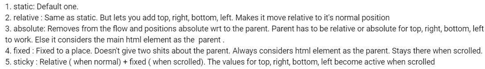

In this project, we'll be applying all the knowledge learnt so far in the FoodVilla project.

A brief about the project: This project is like a Netflix clone, wherein we show all the latest movies, shows, series etc.

We'll be exploring authentication in this project. Although authentication is mostly backend oriented, and we'll not build a NodeJS backend for the same. Instead, we'll setup a Firebase backend and connect our React application to the Firebase backend.

We'll also be exploring about protected routes (which are routes in a React application which require the user to be authenticated before accessing).

We'll also be looking at form handling: learning how to build sign-in and sign-up forms etc.

We'll also be integrating GPT APIs into the project. Let's understand about the usecases for GPT in our application: The user can search for 'funny Hindi Movies' and the recommendations for the same will be powered by GPT.

It's also important to note that the knowledge gained while building these projects are extremely helpful while building any frontend large scale application.

We'll also be focusing on styling using TailwindCSS, and making the UI of our web app look good.

## NetflixGPT Episode-1 Part-1

We built the FoodVilla project from scratch, and used Parcel as the bundler. But for the sake of this project, we'll use `create-react-app`. `create-react-app` provides a scaffold i.e. an out-of-the-box folder structure on which we can work. As an example, it will install and configure React Testing Library and Jest out of the box.

In order to create the react app, we use the syntax `npx create-react-app <project name>`.

`create-react-app` uses Webpack bundler behind the scenes.

See the package.json to see the start script, which in our case is `npm run start`.

Webpack provides Hot Module Replacement (HMR) out-of-the-box. As a recap, HMR is a feature which provides real-time updates to modules within a running application, without requiring a full page reload. This saves a lot of time during development.

Let's start by installing the dependencies of the project: TailwindCSS.

We'll start by identifying the requirements and desired features in our frontend app. This is the first and most important step during development of a project. The desired features have been discussed in [README](./README.md)

## NetflixGPT Episode-1 Part-2

We start by creating a bare-bones for the different components like Body, Header, Login and Browse.

Let's also set up routing in the application. For now, we'll map the route '/' to Login component and '/browse' route to Browse component. We'll work on making the '/browse' route protected later. In order to set up routing in the React app, we'll leverage React Router DOM Library.

We start by designing the Login component. This component needs quite a bit of styling (which needs lots of trial and error), hence used it the same way as the instructor did. However, here's an interesting summary about CSS positions which helped a lot:

This summary is taken as a comment from this [video](https://www.youtube.com/watch?v=jx5jmI0UlXU).

Don't fret too much about the CSS, just try to understand the different properties being used in Login component. Moreover, the CSS for such designs are just a Google search away, so no worries on that part.

Let's now work on creating a sign up form. We can re-use the login form as a sign up form. We can create a state variable `isSignInForm` which stores information about whether the form is a sign-in form or not. According to the value of this state variable, we modify the verbiage on the form. The value of the state variable is toggled on click of the button due to the onClick callback passed to it.

Let's take a look at form validations : By the way, if we have a form with many fields, and we need to handle form validations and error handling, it's recommended to use a form handling library like Formik which makes things convenient.

## Lecture-1 Part-3

Let us look at validating the form in the data (like email, password) using Regex. We'll also learn the usecase of `useRef` hook while doing this.

We have a usecase to validate the email ID and password when the user signs in/signs up on the form. Now, how do we keep track of the email ID and password submitted through the input form. We can use the following two approaches:

1. Use state variables for email and password, and bind them with the input field values. However, there is a drawback in this approach: Everytime the input field value changes, the state variable changes, which triggers a re-render of the component. This impacts the performance of the application.

2. useRef is a React hook that is used to reference a value that's not needed for re-rendering. As an example, we do not want to trigger a re-render of the application everytime the input field values for email and password changes. So, we can create a reference to these input fields and use the values whenever required.

## Lecture-1 Part-4

Setting up Firebase, as well as deploying the frontend web app to Firebase.

## Lecture-1 Part-5

Let's now set up authentication using Firebase. We can refer the documentation of Firebase for this, it's quite informative.
We are able to set up Firebase for both sign in and sign up functionalities. The next step after a user signs in or signs up successfully should be to navigate to '/browse' route, we'll be working on this next.

## Lecture-1 Part-6

Let's work on storing the user information received from the Firebase backend API upon successful sign-in/sign-up in Redux store, as this information will be reused across different components in the web app.

We'll be defining the reducer corresponding to two actions: addUser and removeUser. The action addUser will be dispatched when the user signs in/up succesfully, whereas the action removeUser will be dispatched when the user signs out of the application.

In order to dispatch the actions addUser and removeUser, we can use the following two approaches:

1. Dispatch the specific action in the respective sign-in/up/out flows.

2. Leverage `onAuthStateChanged` from Firebase which is an observer on the auth object. [Documentation](https://firebase.google.com/docs/auth/web/manage-users)

Anytime the auth object changes due to the user signing in/up/out, the callback function passed to this observer is executed.

The second approach seems better, because it allows us to dispatch the actions in a single flow compared to the first approach where we need to handle dispatch of actions in the respective flows.

Also, one more thing to notice is that `onAuthStateChanged` is an observer (for easier understanding, we can think of it like an event listener). So, it should be executed exactly once. For this, we'll use a useEffect hook with empty dependency array.

Let's now work on the sign out functionality. We'll show the 'sign out' button on the Browse page after the user logs in. When the user clicks on 'Sign out', we need to dispatch an action to clear the user information from the store, and navigate to the home page.

We'll also work on dispatching an action to store the userName in the store, in the sign up flow.

## Lecture-2 Part-1

We'll work on integrating TMDB (The Movies Database) API in our React App, in order to show movie lists.

Before we do that, we need to work on a few things: setting up a protected route for '/browse' so that the non-logged in user cannot access it. Also, if there's a logged in user and they try to access the '/' route, they should be redirected to '/browse' instead of showing the login form.
Another thing: we need to work on a cleanup function to clear the `onAuthStateChanged` observer, once the Header component unmounts.

We are using the 'Now Playing' API from TMBD for the scope of our project. The documentation of TMDB is quite helpful in this regard.

An important note: StrictMode in React helps to find bugs in components early during development.

Strict Mode enables the following development-only behaviours (and not on production):

- The components will re-render an extra time to find bugs caused by impure rerendering.

- The components will re-run effects an extra time to find bugs caused by missing effect cleanup.

- The components will be checked for usage of deprecated APIs.

For the scope of our project, we can choose to disable React Strict Mode.

## Lecture-2 Part-2

Now that we have the data of movies from TMDB API, we can work on storing this data in the Redux store. We'll create moviesSlice, a slice specifically for storing movies data.

## Lecture-2 Part-3

Let's work on a custom hook for the TMDB API call. It's a good practice to use custom hooks for making API calls because:

1. The custom hook is reusable across different components.

2. The API call logic is separated out from the component logic, so it promotes separation of concerns.

3. The hook can be tested separately, and is not tightly coupled with the components.

## Lecture-2 Part-4

Let's now work on building the UI for '/browse' page. Let's start with a high level design first, which will be followed by the low level design:

    - Main Container
        - Movie Trailer (could be the latest or most trending movie etc.)
        - Movie Title
    - Secondary Container
        - MovieList * n (indicates multiple movie list)
            - MovieCard * n

## Lecture-2 Part-5

Building Video Title Component

## Lecture-2 Part-6

Building Video Background Component

In order to build the video background component which shows the trailer of movie, we'll leverage the TMDB Videos API. This API takes movie id as a param and returns a list of videos related to the movie. From these list of videos, we'll work on filtering the video which is of type 'Trailer' and display it on the UI. We'll also dispatch an action to store information about this trailer video in the movies slice.

In order to integrate the video with the UI, we embed the iframe from YouTube on the browse page.

## Lecture-2 Part-7

Let's now work on building the secondary container, which has the movie categories along with the movie cards for different categories.

In order to show the different movie categories, we'll leverage different TMDB APIs which allow us to retrieve the movie lists for different categories such as 'Popular', 'Top Rated', 'Upcoming' etc.

Further, every movie object in the above said list is associated with an imageID, which is hosted on TMDB CDN. This will help us to build the movie cards.

## Lecture-3

In this lecture, we'll work on integrating GPT API in our project.

A brief about GPT :

GPT stands for Generative Pre-trained Transformer and refers to a family of large language models (LLMs) that can understand and generate text in natural language.

Let's break down the acronym:

Generative: Generative AI is a technology capable of producing content, such as text and imagery.

Pre-trained: Pre-trained models are saved networks that have already been taught, using a large data set, to resolve a problem or accomplish a specific task.

Transformer: A transformer is a deep learning architecture that transforms an input into another type of output.

Breaking down the acronym above helps us remember what GPT does and how it works. GPT is a generative AI technology that has been previously trained to transform its input into a different type of output.

OpenAI GPT APIs are paid in nature, instead we can the GPT APIs provided by Groq. Refer this [documentation](https://console.groq.com/docs/quickstart) for steps on how to set up the GPT APIs in the project.

The usecase for which we are integrating GPT API in our project is: We'll fetch the recommendations from GPT for movies based on the prompt entered by the user. (As an example, "Funny Hollywood movies from 1980s"). Once we do that, we'll get the movie details from TMDB API and show the movie posters on the UI.

A small note: ChatGPT is a UI interface built on top of GPT APIs. The difference between the two should be clear.

We'll start by building the GPT Search Page. The header will have a button which redirects to this GPT Search Page.

The GPT Search Component will have two child components: GPT Search Bar and GPT Movie Suggestions.

By default, GPT prevents from making API calls from the frontend (browser like environments), as it risks exposing secret API credentials to attackers.

The best practice to make the API call would be to do it through a backend service. However, if we wish to do it through the frontend, we can do so by setting `dangerouslyAllowedBrowser` to true.

We'll leverage the TMDB [Movies Search API](https://developer.themoviedb.org/reference/search-movie), which allows to search the movies by movie name.

Once we have the movie details from TMDB, we can dispatch an action to store it inside the Redux Store.

Let's also discuss memoization in the React App. We can work on memoizing the results of different API calls like get videos of a component. This prevents making API calls everytime the Browse component is re-rendered and since this data is not needed to be fetched again from the server, memoization is a huge performance optimization. In order to implement memoization, we check if the data is already present in the store. If it is, we do not make the network call.

Let's now work on internationalization feature in our React App: let's build this feature in the GPT Search Component.

Websites with page translation feature rank higher in SEO (Search Engine Optimization).

We'll store the information about the selected language in the store. This data can be reused across different components.

## Responsiveness of the app for mobile view

We'll work on ensuring the responsiveness of the app for different screen sizes.
