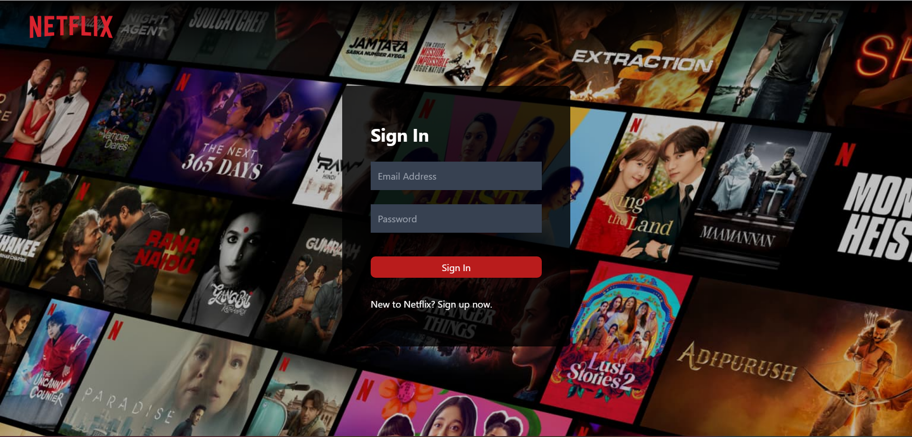
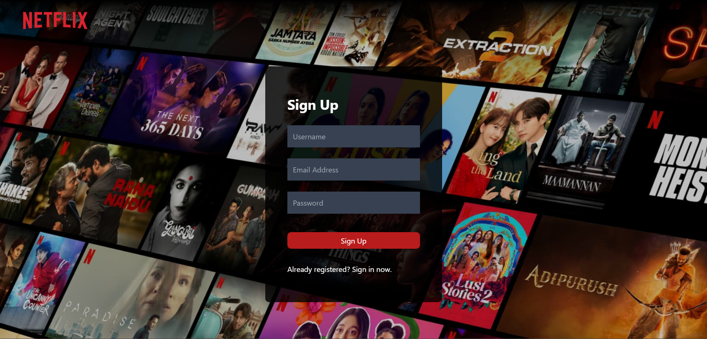
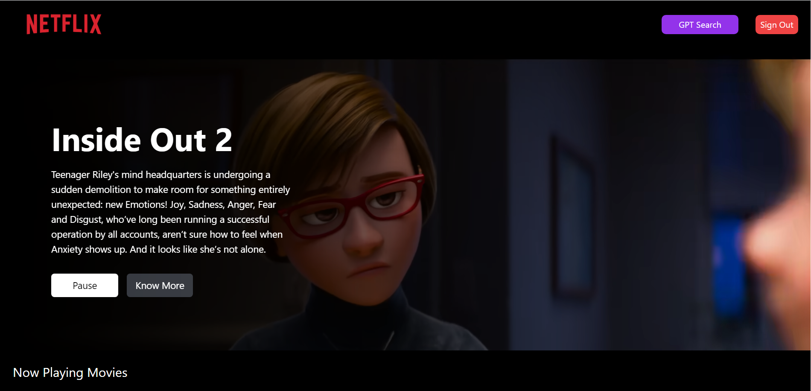
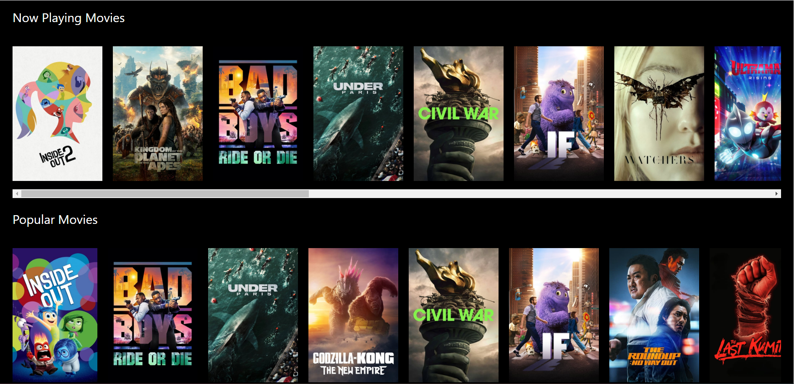
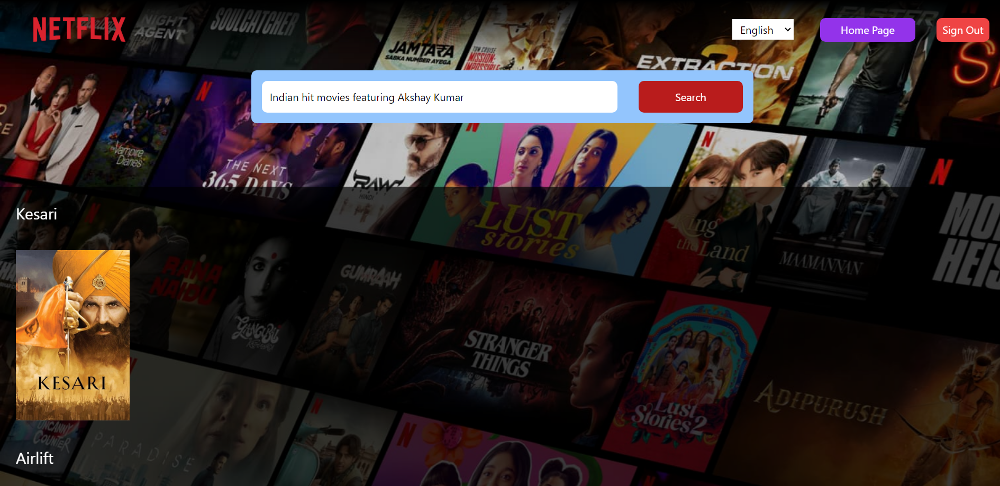

## Netflix GPT : About the project

The Netflix GPT App is an AI-driven platform that enhances the Netflix experience. It leverages OpenAI's GPT-3.5 model to provide personalized content recommendations. This project is for Netflix enthusiasts seeking a more engaging and customized streaming experience. It empowers users to explore content effortlessly, engage in natural language interactions, and gain a deeper understanding of their favorite shows and movies. Whether you're a seasoned Netflix user or just starting your streaming journey, this app is designed to make your entertainment experience more enjoyable and enriching.

## Features

* Form Validation: Form validation to enhance user experience and ensure data integrity.

* Firebase Integration: Integration with Firebase Backend for user authentication.

* TMDB Integration: Integration with The Movie Database (TMDB) APIs to fetch movie lists of different genres.

* GPT Powered Search: Leveraging GPT APIs for movie recommendations based on the user prompt.

* Internationalization: Offers support for English, Hindi and Spanish languages with integrated language-switching feature.

* Responsive Design: Responsive web design for devices of all screen sizes.

## Tech Stack Used

-   **React:** Powering the interactive and user-friendly interface.

-   **Firebase:** Handling user authentication, data storage, and more.

-   **OpenAI:** Leveraging the GPT model for movie recommendations.

-   **React Router DOM:** Enabling smooth navigation and user-friendly routing.

-   **ReduxJS Toolkit:** Managing application state efficiently.

-   **Tailwind CSS:** Crafting a visually appealing and responsive design.

## Screenshots from the project:

**Sign In page:**

**Sign Up Page:**

**Home Page (logged-in used user only):**

**GPT Search Page:**

**High Level Design of the Project:** [Documented here](https://docs.google.com/document/d/1B9OEFK0Sl6gVvUyK8d86-4legFB0MdsScbLkGbWBaD4/edit?usp=sharing)

**Low Level Design of the Project:**

- Login/Sign Up feature
    - Header
    - Sign In/Sign up form
    - Redirect to browse page after successful login

- Browse Page (protected route, accessible only after authentication)

    - Header
    - Main Container
        - Movie Trailer
        - Movie Title
    - Secondary Container
        - MovieList * n (indicates multiple movie lists)
        - MovieCard * n

- GPT Search Page

    - Search Bar
    - Movie Suggestions (which is essentially Movie List component)

